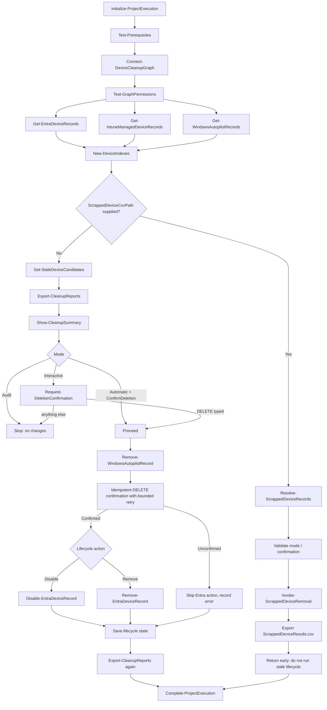

# Architecture

## Overview

`Invoke-StaleDeviceCleanup.ps1` is a thin orchestration script that imports
`StaleDeviceCleanup.psm1` and drives a linear pipeline:

## Module layout

All logic lives in `src/StaleDeviceCleanup.psm1`, organized by `#region`:

| Region | Responsibility |
| --- | --- |
| Logging | `Write-CleanupLog` – structured, timestamped, never logs secrets |
| Prerequisites and connection | Module checks, `Connect-MgGraph` wrapper, scope validation |
| Retry logic | `Invoke-GraphWithRetry` – bounded, exponential backoff, honors `Retry-After` |
| Discovery | `Get-EntraDeviceRecords`, `Get-IntuneManagedDeviceRecords`, `Get-WindowsAutopilotRecords` – one paginated call each, never per-device |
| Normalization helpers | `ConvertTo-NormalizedSerialNumber`, `Get-SafeUtcTimestamp`, `Resolve-DevicePlatform` |
| Indexing and correlation | `New-DeviceIndexes`, `Resolve-DeviceCorrelation` |
| Activity evaluation | `Get-EffectiveLastActivity` |
| Protection | `Test-DeviceProtection` |
| Evaluation orchestration | `Get-StaleDeviceCandidates` – produces one evaluated record per Entra device |
| Summary and confirmation | `Show-CleanupSummary`, `Request-DeletionConfirmation` |
| Reporting | `Export-CleanupReports`, `New-RunSummary` |
| Lifecycle state | `Get-DeviceLifecycleState` / `Save-DeviceLifecycleState` – persists the first observed disabled timestamp |
| Scrapped device cleanup | `Get-ScrappedDeviceSerialNumbers`, `Resolve-ScrappedDeviceRecords` – correlate `-ScrappedDeviceCsvPath` serial numbers against already-discovered Entra/Intune/Autopilot data, no extra Graph calls |
| Deletion (guarded) | `Remove-WindowsAutopilotRecord`, bounded Autopilot DELETE confirmation, `Disable-EntraDeviceRecord`, `Remove-EntraDeviceRecord`, `Remove-IntuneManagedDeviceRecord`, `Invoke-ScrappedDeviceRemoval` – all state-changing calls use `ShouldProcess` |
| Execution lifecycle | `Initialize-ProjectExecution`, `Complete-ProjectExecution` |

Discovery, correlation, evaluation, reporting, confirmation, and deletion are
implemented as separate functions so each stage can be unit tested in
isolation with mocked Graph cmdlets.

## Data flow

1. Discovery retrieves the complete Entra, Intune, and Autopilot data sets in
   three paginated Graph calls (`-All`).
2. `New-DeviceIndexes` builds hash tables keyed by normalized identifiers so
   correlation is O(1) per device instead of one Graph request per device.
3. `Get-StaleDeviceCandidates` iterates the Entra device list once, producing
   an `AllEvaluatedDevices` collection with a `Decision` of `Candidate`,
   `Excluded`, or `ManualReview`, plus a machine-readable `ReasonCode`.
4. The lifecycle state file records when each disabled Entra object was first
   observed. Reports are written before any confirmation prompt is shown.
5. If the `-ScrappedDeviceCsvPath` workflow is enabled, `Resolve-ScrappedDeviceRecords`
   correlates the CSV serials against the already-discovered Entra/Intune/Autopilot
   sets without issuing extra Graph calls. When a serial exists in Autopilot,
   the row set is expanded to include every related Entra and Intune object for
   that same serial; otherwise duplicate serials remain `Ambiguous` and are left
   untouched. This branch is validated for mode/confirmation before it exits
   early and never enters the standard stale lifecycle.
6. If changes are permitted and the scrapped-device branch is not active, active
   stale candidates remove Autopilot when applicable and then disable Entra.
   Disabled candidates are removed only after `DaysDisabled` has elapsed. A Graph
   `AlreadyDeleted` response confirms the Autopilot step; repeated
   `DeletionInProgress` responses block both Entra actions.
