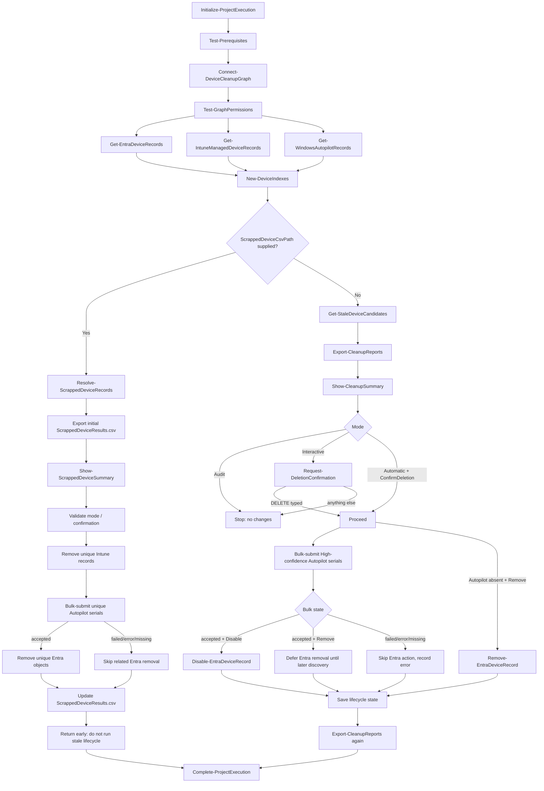

# Architecture

## Overview

`Invoke-StaleDeviceCleanup.ps1` is a thin orchestration script that imports
`StaleDeviceCleanup.psm1` and drives a linear pipeline:

## Module layout

All logic lives in `src/StaleDeviceCleanup.psm1`, organized by `#region`:

| Region | Responsibility |
| --- | --- |
| Logging | `Write-CleanupLog` – structured, timestamped, never logs secrets |
| Prerequisites and connection | Module checks, `Connect-MgGraph` wrapper, scope validation |
| Retry logic | `Invoke-GraphWithRetry` – bounded, exponential backoff, honors `Retry-After` |
| Discovery | `Get-EntraDeviceRecords`, `Get-IntuneManagedDeviceRecords`, `Get-WindowsAutopilotRecords` – one paginated call each, never per-device |
| Normalization helpers | `ConvertTo-NormalizedSerialNumber`, `Get-SafeUtcTimestamp`, `Resolve-DevicePlatform` |
| Indexing and correlation | `New-DeviceIndexes`, `Resolve-DeviceCorrelation` |
| Activity evaluation | `Get-EffectiveLastActivity` |
| Protection | `Test-DeviceProtection` |
| Evaluation orchestration | `Get-StaleDeviceCandidates` – produces one evaluated record per Entra device |
| Summary and confirmation | `Show-CleanupSummary`, `Show-ScrappedDeviceSummary`, `Request-DeletionConfirmation` |
| Reporting | `Export-CleanupReports`, `New-RunSummary` |
| Lifecycle state | `Get-DeviceLifecycleState` / `Save-DeviceLifecycleState` – persists the first observed disabled timestamp |
| Scrapped device cleanup | `Get-ScrappedDeviceSerialNumbers`, `Resolve-ScrappedDeviceRecords` – correlate `-ScrappedDeviceCsvPath` serial numbers against already-discovered Entra/Intune/Autopilot data, no extra Graph calls |
| Deletion (guarded) | `Submit-WindowsAutopilotBulkRemoval`, `Disable-EntraDeviceRecord`, `Remove-EntraDeviceRecord`, `Remove-IntuneManagedDeviceRecord`, `Invoke-ScrappedDeviceRemoval` – all state-changing calls use `ShouldProcess`; `Remove-WindowsAutopilotRecord` remains a low-level compatibility helper |
| Execution lifecycle | `Initialize-ProjectExecution`, `Complete-ProjectExecution` |

Discovery, correlation, evaluation, reporting, confirmation, and deletion are
implemented as separate functions so each stage can be unit tested in
isolation with mocked Graph cmdlets.

The scrapped-device bulk submission uses the Microsoft Graph v1.0
[`deleteDevices` action](https://learn.microsoft.com/graph/api/intune-enrollment-windowsautopilotdeviceidentity-deletedevices?view=graph-rest-1.0).
Its per-serial `accepted` state acknowledges asynchronous processing; it does
not guarantee that the record has already disappeared from the portal.

## Data flow

1. Discovery retrieves the complete Entra, Intune, and Autopilot data sets in
   three paginated Graph calls (`-All`).
2. `New-DeviceIndexes` builds hash tables keyed by normalized identifiers so
   correlation is O(1) per device instead of one Graph request per device.
3. `Get-StaleDeviceCandidates` iterates the Entra device list once, producing
   an `AllEvaluatedDevices` collection with a `Decision` of `Candidate`,
   `Excluded`, or `ManualReview`, plus a machine-readable `ReasonCode`.
4. The lifecycle state file records when each disabled Entra object was first
   observed. Reports are written before any confirmation prompt is shown.
5. If the `-ScrappedDeviceCsvPath` workflow is enabled, `Resolve-ScrappedDeviceRecords`
   correlates the CSV serials against the already-discovered Entra/Intune/Autopilot
   sets without issuing extra Graph calls. When a serial exists in Autopilot,
   the row set is expanded to include every related Entra and Intune object for
   that same serial; otherwise duplicate serials remain `Ambiguous` and are left
   untouched. The initial report and exact unique-object summary are produced
   before mode validation or an interactive confirmation prompt. After
   confirmation, unique Intune records are removed first, then unique serials
   are sent once in sequential chunks of at most 100 to the Graph
   `deleteDevices` bulk action. An `accepted` state
   permits related Entra cleanup without polling for eventual consistency;
   other or missing states block Entra removal. This branch then exits early
   and never enters the standard stale lifecycle.
6. If changes are permitted and the scrapped-device branch is not active,
   High-confidence Autopilot serials are submitted through the same bulk action
   in sequential chunks of at most 100. An `accepted` state permits active stale Entra objects to be
   disabled. Permanent Entra removal is deferred while discovery still finds
   the Autopilot identity; a later run removes the eligible disabled Entra
   object only after Autopilot is absent.
