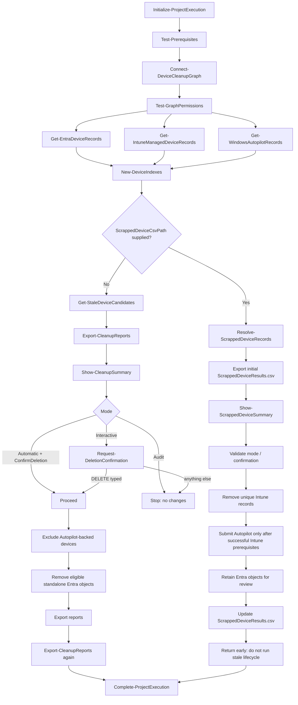

# Architecture

## Overview

`Invoke-StaleDeviceCleanup.ps1` is a thin orchestration script that imports
`StaleDeviceCleanup.psm1` and drives a linear pipeline:

```mermaid
flowchart TD
    A[Initialize-ProjectExecution] --> B[Test-Prerequisites]
    B --> C[Connect-DeviceCleanupGraph]
    C --> D[Test-GraphPermissions]
    D --> E[Get-EntraDeviceRecords]
    D --> F[Get-IntuneManagedDeviceRecords]
    D --> G[Get-WindowsAutopilotRecords]
    E --> H[New-DeviceIndexes]
    F --> H
    G --> H
    H --> X{ScrappedDeviceCsvPath supplied?}
    X -->|Yes| Y[Resolve-ScrappedDeviceRecords]
   Y --> Y1[Export initial ScrappedDeviceResults.csv]
   Y1 --> Y2[Show-ScrappedDeviceSummary]
   Y2 --> Z1[Validate mode / confirmation]
   Z1 --> ZA[Remove unique Intune records]
    ZA --> ZB[Submit Autopilot only after successful Intune prerequisites]
    ZB --> ZC[Retain Entra objects for review]
    ZC --> Z3[Update ScrappedDeviceResults.csv]
    Z3 --> Z4[Return early: do not run stale lifecycle]
    X -->|No| I[Get-StaleDeviceCandidates]
    I --> J[Export-CleanupReports]
    J --> K[Show-CleanupSummary]
    K --> L{Mode}
    L -->|Audit| M[Stop: no changes]
    L -->|Interactive| N[Request-DeletionConfirmation]
    L -->|Automatic + ConfirmDeletion| O[Proceed]
    N -->|DELETE typed| O
    N -->|anything else| M
   O --> P[Exclude Autopilot-backed devices]
   P --> T[Remove eligible standalone Entra objects]
    T --> V[Export reports]
    V --> W[Export-CleanupReports again]
    W --> Z5[Complete-ProjectExecution]
    Z4 --> Z5
```

## Module layout

All logic lives in `src/StaleDeviceCleanup.psm1`, organized by `#region`:

| Region | Responsibility |
| --- | --- |
| Logging | `Write-CleanupLog` – structured, timestamped, never logs secrets |
| Prerequisites and connection | Module checks, `Connect-MgGraph` wrapper, scope validation |
| Retry logic | `Invoke-GraphWithRetry` – bounded, exponential backoff, honors `Retry-After` |
| Discovery | `Get-EntraDeviceRecords`, `Get-IntuneManagedDeviceRecords`, `Get-WindowsAutopilotRecords` – one paginated call each, never per-device |
| Normalization helpers | `ConvertTo-NormalizedSerialNumber`, `Get-SafeUtcTimestamp`, `Resolve-DevicePlatform` |
| Indexing and correlation | `New-DeviceIndexes`, `Resolve-DeviceCorrelation` |
| Activity evaluation | `Get-EffectiveLastActivity` |
| Protection | `Test-DeviceProtection` |
| Evaluation orchestration | `Get-StaleDeviceCandidates` – produces one evaluated record per Entra device |
| Summary and confirmation | `Show-CleanupSummary`, `Show-ScrappedDeviceSummary`, `Request-DeletionConfirmation` |
| Reporting | `Export-CleanupReports`, `New-RunSummary` |
| Lifecycle state | Legacy report fields only; direct deletion no longer uses a retention ledger |
| Scrapped device cleanup | `Get-ScrappedDeviceSerialNumbers`, `Resolve-ScrappedDeviceRecords` – correlate `-ScrappedDeviceCsvPath` serial numbers against already-discovered Entra/Intune/Autopilot data, no extra Graph calls |
| Deletion (guarded) | `Submit-WindowsAutopilotIdentityRemoval`, `Remove-EntraDeviceRecord`, `Remove-IntuneManagedDeviceRecord`, `Invoke-ScrappedDeviceRemoval` – all state-changing calls use `ShouldProcess` |
| Batch transport | `src/DeviceDeletionBatch.ps1`, included by the module: hashed plans, guarded phased batching, per-ID parsing/retries, journal and verification |
| Execution lifecycle | `Initialize-ProjectExecution`, `Complete-ProjectExecution` |

Discovery, correlation, evaluation, reporting, confirmation, and deletion are
implemented as separate functions so each stage can be unit tested in
isolation with mocked Graph cmdlets.

Autopilot removal uses the supported identity DELETE endpoint. A successful
response acknowledges the deletion request; it does not guarantee that the
record has already disappeared from the portal.

## Data flow

1. Discovery retrieves the complete Entra, Intune, and Autopilot data sets in
   three paginated Graph calls (`-All`).
2. `New-DeviceIndexes` builds hash tables keyed by normalized identifiers so
   correlation is O(1) per device instead of one Graph request per device.
3. `Get-StaleDeviceCandidates` iterates the Entra device list once, producing
   an `AllEvaluatedDevices` collection with a `Decision` of `Candidate`,
   `Excluded`, or `ManualReview`, plus a machine-readable `ReasonCode`.
4. Reports are written before any confirmation prompt is shown. Direct Entra
   removal does not depend on lifecycle state or a disabled retention period.
5. If the `-ScrappedDeviceCsvPath` workflow is enabled, `Resolve-ScrappedDeviceRecords`
   correlates CSV serials against already-discovered Entra/Intune/Autopilot
   sets without extra Graph calls. Duplicate matches fail closed even with
   Autopilot present; protection/platform/conflicting-ID exclusions remain
   effective. Related Entra records are for review only. The initial report and exact unique-object summary are produced
   before mode validation or an interactive confirmation prompt. After
   confirmation, unique Intune records are removed first, then each unique
   Autopilot identity is submitted through the identity DELETE endpoint. A
   failed Intune prerequisite blocks related Autopilot deregistration.
   No related Entra deletion occurs. This branch then exits early
   and never enters the standard stale lifecycle.
6. The stale branch excludes Autopilot-backed records and removes only
   eligible standalone Entra objects after approval.
7. `Individual` remains the default transport. Opt-in `JsonBatch` executes
   the same eligible set in independent batches of at most 20 operations,
   with phased dependencies, tenant checks and journal checkpointing.
   [BatchDeletion.md](BatchDeletion.md) describes failure and verification semantics.
